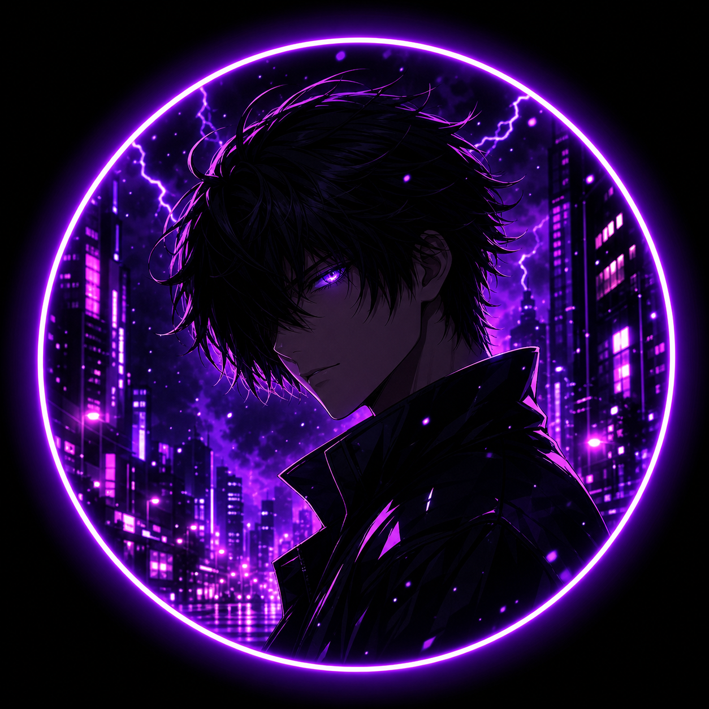

# Shadow Client

Black-and-neon Android client for the Free Fire community — your branding, your keys, your
floating icon, your Telegram.

<p align="center">
  
</p>

## Download

Every push to `main` builds signed APKs automatically:

**➡️ [Download the latest APK](https://github.com/demoneditz985-ctrl/ShadowClientFF/releases/latest)**

* **`ShadowClient-1.1.0-arm64.apk`** — install this on any phone from ~2018 onwards.
* **`ShadowClient-1.1.0-arm32.apk`** — only for very old 32-bit phones.
* Android **9+** (`minSdk 28`), targets `SDK 35`, so it also installs on Android 16/17.

## What's inside

| | |
|---|---|
| 🌑 **Dark black theme** | Pure-black surfaces, violet/magenta neon accents, drifting particle background |
| 🔑 **Key login** | `SHADOWCLIENT` works out of the box; generate keys with `tools/keygen.js`, or run the bundled key server for revocable, device-locked keys — see **[How to generate keys](HOW-TO-GENERATE-KEYS.md)** |
| 🎈 **Floating menu** | Tap the logo in-game → node + live ping, **OPEN FREE FIRE**, **FF MAX**, dashboard, Telegram, hide. Drag to move |
| 🚀 **Game launcher** | Buttons that open Free Fire / Free Fire MAX (or the store page if not installed) |
| 🛰️ **Real engine** | Official open-source sing-box core bundled — VLESS, VMess, Trojan, Shadowsocks, Hysteria2 |
| 🌐 **Node list** | Add your own hosts, real TCP ping per node, Free Fire / Free Fire MAX selector |
| ✈️ **Telegram only** | Join button wired to your invite link — no WhatsApp branding, links or icons anywhere |
| 🖼️ **Your logo everywhere** | Adaptive launcher icon, splash, login, dashboard, notification |

## Screens

`Splash` → `ACCESS KEY` (login) → `Dashboard`
— active module card, activate toggle, game selector + launch buttons, node list with ping,
floating-icon switch, account card (masked key, activation date, expiry), Telegram community button.

In game: the floating logo expands into a compact menu so you never have to leave the match.

## Quick start for the owner

1. Install the APK and log in with **`SHADOWCLIENT`**.
2. Read **[SETUP.md](SETUP.md)** — it covers keys, the key server, branding, signing and the
   engine plug-in point.
3. Want to hand out keys? `node tools/keygen.js --n 10 --write` for offline keys, or set
   `Config.KEY_API_URL` to your own `server/key-server.js` deployment for revocable keys.
   Step-by-step: **[HOW-TO-GENERATE-KEYS.md](HOW-TO-GENERATE-KEYS.md)**.
4. To make the tunnel connect, add your own node in **ADD SERVER** (host, port, UUID/password).
   Demo rows only measure ping — see SETUP.md §5.

## Repository layout

```
app/src/main/java/com/shadowclient/ff/
  auth/KeyManager.java        key validation, device binding, sessions
  core/ServerRepo.java        node list + real TCP ping
  core/ShadowEngine.java      engine plug-in point (see SETUP.md §5)
  overlay/FloatingIconService.java   the floating logo + in-game menu
  ui/                         Splash, Login, Dashboard, particle background
app/src/engineSingbox/…       sing-box platform glue (when libbox.aar is present)
server/key-server.js          dependency-free key server (issue / revoke / reset devices)
tools/keygen.js               key generator (offline + server)
tools/make_icons.py           rebuild every icon size from one master image
HOW-TO-GENERATE-KEYS.md       the key guide
keystore/shadowclient.jks     release signing key (keep it safe!)
```

## Notes

* Written from scratch as a clean-branded build: no third-party client code, no borrowed assets,
  no copied package name.
* The engine is the **official sing-box core** built from upstream source (GPL-3.0) — see
  SETUP.md §5, including the licensing note and how to add your node.
* Original `dripclient-wire-v3.2.0.apk` stays in the repo untouched, for reference only.
